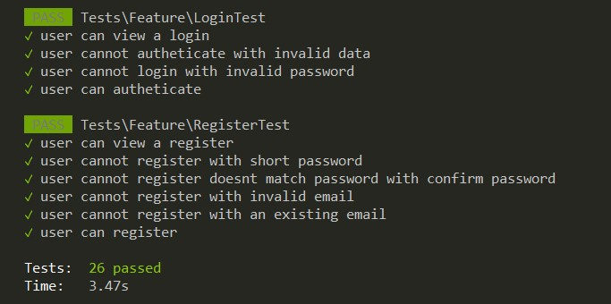

# Laravel Testing

App to test a register and user login.

# Requirements

The app requires the following:

- Laravel Framework version `8.65`.
- PHP version `8.1.4`.
- PostGreSQL version `15.1.1`.

# Installing

1. Installing the php dependencies

```bash
composer install
```

2. Copy the `.env.example` file and save it as `.env`

3. Set the `APP_KEY` value in your .env file


```bash
php artisan key:generate
```

4. Run the migrations

```bash
php artisan migrate
```

5. Run the test

```bash
php artisan test --filter RegisterTest
php artisan test --filter LoginTest

```

# Important Files

- `test\Feature\RegisterTest`
- `test\Feature\LoginTest`

# Preview



## Credits

[Rafael Delgado](mailto:delgadorafael2011@gmail.com).
